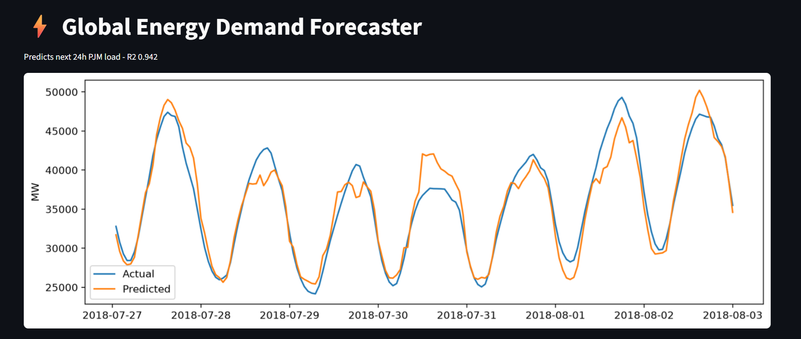

# Global Energy Demand Forecaster

I wanted to build something that actually matters for the grid, not just another iris dataset. This predicts US energy demand 24h ahead, if you can forecast this well, you can save money and avoid blackouts.

### Live Demo
I built a quick Streamlit app to visualize the forecast.

Run it locally: `streamlit run app.py`

### Data
PJM Hourly Energy Consumption from Kaggle: 145k hourly readings from 2002 to 2018 for the US East grid.
Link: https://www.kaggle.com/datasets/robikscube/hourly-energy-consumption
I only used PJME_hourly.csv.

### What I actually did
- Started with a dumb baseline: just use yesterday same hour (lag 24). If you can't beat that, your model is useless.
- Feature engineering: lag 24h, lag 168h (same hour last week), rolling mean/std 24h, hour of day, day of week, month.
- Was careful with leakage, all rolling features are shifted by 1, so no future data.
- Used TimeSeriesSplit, not random shuffle.
- Tried Ridge, then RandomForest with GridSearchCV.

### Results
- Naive lag24: MAE 2184.22 MW
- Ridge: MAE 1836.89 | RMSE 2447.62 | R2 0.858
- RandomForest (200 trees, depth 20): MAE 1150.73 | RMSE 1566.19 | R2 0.942

That's ~47% better than naive.

### How to run it
pip install -r requirements.txt
python src/train.py
streamlit run app.py

### Structure
data/ -> PJME_hourly.csv (not pushed)
src/train.py -> main training script
models/ -> saved model
app.py -> streamlit demo

### What I'd do next
- Add weather data, that would probably cut error another 10-15%
- Try XGBoost / LightGBM
- Deploy live on Streamlit Cloud

Built this to learn time series properly. Open to feedback.